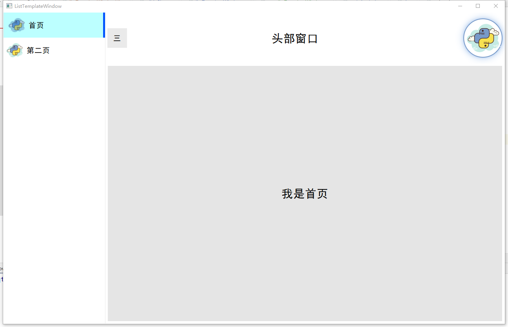

# 模板窗口

```
模块窗口主要是为快速开发而生,已最快的方式来创建一个干净,漂亮的窗口界面,来帮你省去大量花费在设计界面的时间.
```

### ListTemplateWindow

```
ListTemplateWindow是一个通过点击左则选项来切换右侧界面的窗口
```



#### 使用方式

```python
from PyQtGuiLib.templateWindow import ListTemplateWindow

继承 ListTemplateWindow
```

#### 主要方法

**<font color=blue>setHeadPicture(<font color=green>path:str</font>)</font>**

- **功能:** 设置头像
- **path:** 路径

**<font color=blue>addItem(<font color=green>text:typing.Union[str,QListWidgetItem],widget:QWidget,icon:str=None</font>)</font>**

- **功能:** 添加节点和窗口

- **text:** 节点文本
- **widget:** 窗口
- **icon:** 节点图标路径

**<font color=blue>addMenu(<font color=green>item:dict</font>)</font>**

- **功能:** 添加菜单项(点击头像弹出)

- **item:** 文本和回调函数(参数格式如下)

  ```
  {
  	"text":文本,
  	"call":回调函数
  }
  ```

**<font color=blue>addHeadWidget(<font color=green>widget:QWidget</font>)</font>**

- **功能:** 添加头部窗口

#### 细节设置

- 重新设置左侧 **QListWidget**样式,用使用对象 `self.listWidget`

- 重新设置头像 **QPushButton**样式,使用对象 `self.btn_fold`
- 重新设置窗口的切换速度,使用方法 `self.stackedWidget.setDuration()`

#### 例子

```python
# -*- coding:utf-8 -*-
# @time:2023/4/1112:42
# @author:LX
# @file:test_listTemplateWindow.py
# @software:PyCharm
from PyQtGuiLib.header import (
    PYQT_VERSIONS,
    QApplication,
    sys,
    QWidget,
    QLabel,
    Qt
)

from random import randint
from PyQtGuiLib.templateWindow import ListTemplateWindow

'''
    测试 实际使用 模板窗口
'''

class myWidget(ListTemplateWindow):
    def __init__(self,*args,**kwargs):
        super().__init__(*args,**kwargs)

        # 添加菜单
        self.addMenu({
            "text": "测试",
            "call": self.test,
        })

        # 添加头像
        self.setHeadPicture(r"D:\code\PyQtGuiLib\tests\temp_image\python1.png")

        # 添加页面
        self.addItem("首页",self.frist_page(),r"D:\code\PyQtGuiLib\tests\temp_image\python1.png")
        self.addItem("第二页",self.two_page(),r"D:\code\PyQtGuiLib\tests\temp_image\python1.png")

        # 头部窗口
        self.addHeadWidget(self.headWidget())

    def test(self):
        print("测试回调函数")

    def frist_page(self):
        widget = QLabel("我是首页")
        widget.setAlignment(Qt.AlignCenter)
        widget.setStyleSheet('''
background-color: rgb(229, 229, 229);
font: 22pt "黑体";
        ''')
        return widget

    def two_page(self):
        widget = QLabel("我是第二页")
        widget.setAlignment(Qt.AlignCenter)
        widget.setStyleSheet('''
        background-color: #ffd997;
        font: 22pt "黑体";
                ''')
        return widget

    def headWidget(self):
        widget = QLabel("头部窗口")
        widget.setAlignment(Qt.AlignCenter)
        widget.setStyleSheet('''
        font: 22pt "黑体";
                ''')
        return widget

if __name__ == '__main__':
    app = QApplication(sys.argv)

    win = myWidget()
    win.show()

    if PYQT_VERSIONS in ["PyQt6","PySide6"]:
        sys.exit(app.exec())
    else:
        sys.exit(app.exec_())

```

